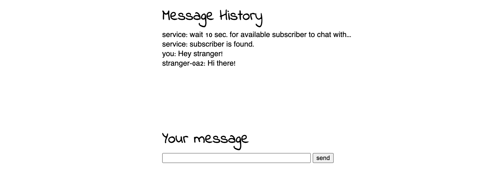

# go-now-here
No(w)here - chat now & here with a random person.  


## Description
This project is a simple WebSocket-based chat where your messages are sent only to one randomly selected person from the pool of available connections. Simply put, it is a chat with a randomly assigned person.

There are no additional configuration possibilities, no fancy UI, no security measures, no tests, no HTTPS, no CORS, etc. - just a roughly implemented idea.

## Run
```
make build  # to build Docker image
make run    # to run application using docker compose
make stop   # to stop appllication
make delete # to delete container with application
```